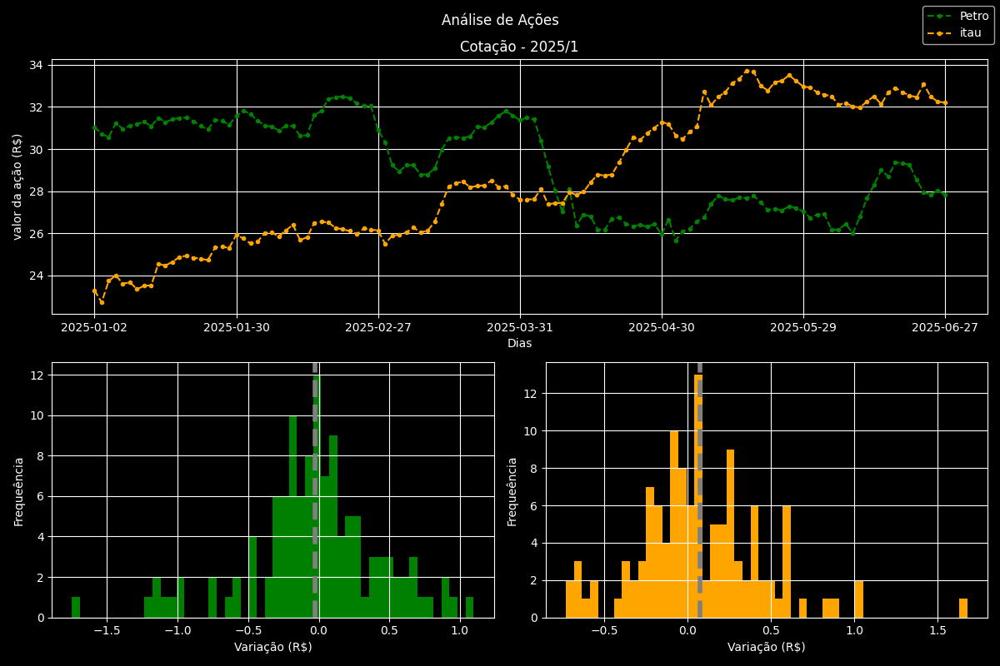

# 📈 Análise e Visualização de Ações (PETR4 e ITUB4)

Este é um projeto prático de Análise de Dados desenvolvido em Python. O objetivo principal foi aplicar técnicas de manipulação e visualização de dados financeiros, recriando as variações diárias e a frequência de retorno de ações da Bolsa de Valores brasileira do primeiro semestre de 2025.

Projeto inspirado no tutorial de Matplotlib da [Asimov Dados](https://www.youtube.com/watch?v=unEdvkCjL8U).

## 📸 Resultado Final do Dashboard

## 🛠️ Ferramentas Utilizadas

- **Python 3**
- **Jupyter Notebook:** Para desenvolvimento interativo.
- **Pandas:** Para manipulação, limpeza e leitura dos dados em CSV.
- **Matplotlib:** Para a criação de todos os gráficos (linhas, histogramas, subplots e personalização visual avançada).
- **yfinance:** (Bônus) Para extrair os dados históricos reais do Yahoo Finance diretamente via código.

## 📊 Principais Visualizações e Técnicas

- **Gráfico de Linha Interligado:** Visualização do histórico de fechamento diário das ações.
- **Histogramas e Distribuições:** Para analisar a frequência das variações (retornos) diárias.
- **Cálculo de Médias (Linha Vertical):** Exibindo visualmente a tendência média de retorno de cada ativo.
- **Grades Personalizadas (GridSpec):** Construção de um painel em formato de Dashboard, colocando um gráfico amplo em cima e dois menores abaixo.

## 🚀 Como executar este projeto

1. Clone este repositório no seu computador:
   `git clone https://github.com/pedrolucasds/Projeto-analise-acoes-python.git`
2. Garanta que você tem o Python e as bibliotecas instaladas (`pip install pandas matplotlib yfinance jupyter`).
3. Abra a pasta do projeto no VS Code ou terminal.
4. Execute o arquivo interativo `analise_acoes.ipynb`.

## 🧑‍💻 Autor

_Desenvolvido por [Pedro Lucas Lopes Souza](https://www.linkedin.com/in/pedro-lucas-lopes-souza/)_
